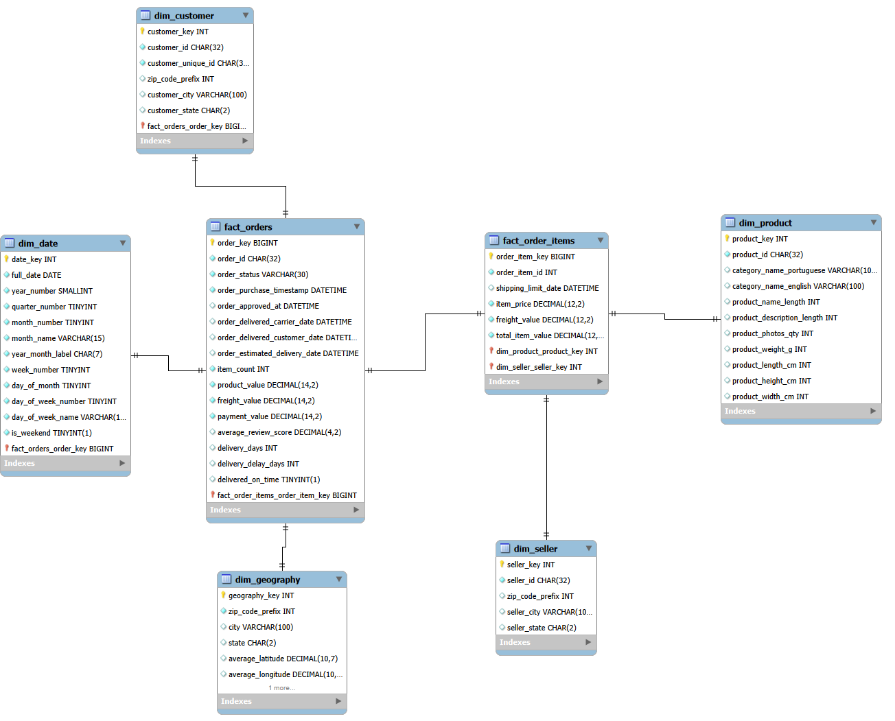

# 面向业务分析的数据仓库搭建与 SQL 指标分析

## 1. 项目简介

本项目基于 Olist 巴西电商公开数据集，搭建 MySQL 电商数据仓库，
并使用 SQL 完成月度经营分析、商品品类排名、客户 RFM 分层和地区履约质量分析。

项目重点展示：

- 原始 CSV 数据导入与数据质量检查
- MySQL 暂存层、维度层和事实层设计
- 多表 JOIN、CTE、窗口函数和聚合分析
- 经营指标口径设计
- 从数据结果提炼可执行的业务建议

## 2. 数据来源

原始数据集：

- Olist Brazilian E-Commerce Public Dataset
- 原始来源：Olist / Kaggle
- 本项目通过公开 GitHub 镜像下载
- 原始数据仅用于学习和项目展示，不代表任何企业内部数据

项目使用9张关联表：

- customers
- geolocation
- orders
- order_items
- order_payments
- order_reviews
- products
- sellers
- product_category_name_translation

## 3. 数据仓库架构



项目采用星型模型：

```text
维度表：
dim_date
dim_geography
dim_customer
dim_product
dim_seller

事实表：
fact_orders
fact_order_items
```

## 4. 项目结果
### 数据规模
| 数据对象 | 行数 |
|---|---:|
| 客户 | 99,441 |
| 订单 | 99,441 |
| 订单商品明细 | 112,650 |
| 支付记录 | 103,886 |
| 评价记录 | 99,223 |
| 商品 | 32,951 |
| 卖家 | 3,095 |
| 地理位置记录 | 1,000,163 |

### 核心经营指标
- 商品金额合计：13,591,643.70
- 运费合计：2,251,909.54
- 支付金额合计：16,008,872.12
- 平均评价分：4.09
- 平均配送时长：12.50天
- 按时或提前送达订单：88,649
- 延迟送达订单：7,827

### 主要分析结论
- 2017年11月商品GMV达到约1,003,862，为完整周期内最高月份。
- health_beauty品类GMV排名第一，占总GMV约9.31%。
- 前五大品类合计贡献约40%的商品GMV，存在明显的头部品类贡献。
- 沉睡风险客户占客户总数约50%，平均最近购买间隔约440天，存在较大的召回空间。
- 高价值客户占比约6.08%，但平均消费金额达到238.80，高于其他客户群体。
- 延迟送达订单平均评分为2.57，按时或提前送达订单平均评分为4.29。
- 延迟订单低分率为53.98%，按时订单低分率为9.19%，两者存在明显关联。

> 注意：上述结论基于公开订单快照，只能说明数据中的相关关系，
> 不能直接证明配送延迟对评分存在因果影响。

## 5. 技术栈
- MySQL 8
- SQL
- MySQL Workbench
- CSV / UTF-8
- 数据仓库建模
- CTE
- Window Functions
- JOIN
- 聚合分析
- GitHub

## 6. SQL能力展示
项目中使用了：
- `LOAD DATA LOCAL INFILE`
- `CREATE TABLE`
- 主键、外键和索引设计
- `INNER JOIN`、`LEFT JOIN`
- `GROUP BY`
- `CASE WHEN`
- `LAG()`
- `NTILE()`
- `DENSE_RANK()`
- `SUM() OVER()`
- 视图封装

## 7. 项目目录
```text
project-013-业务分析数据仓库SQL项目/
├── README.md
├── 00_项目说明.md
├── 01_需求与目标.md
├── 02_执行记录.md
├── 03_复盘总结.md
├── assets/
├── data/
├── docs/
├── outputs/
│   ├── olist_dw_erd.mwb
│   └── screenshots/
│       └── 01_data_warehouse_erd.png
└── src/
    ├── 01_create_database.sql
    ├── 02_create_staging_tables.sql
    ├── 02_load_staging_data.sql
    ├── 03_validate_staging_data.sql
    ├── 04_create_dimension_tables.sql
    ├── 05_load_dimensions.sql
    ├── 06_create_fact_tables.sql
    ├── 07_clean_staging_dates.sql
    ├── 08_load_fact_tables.sql
    ├── 09_business_analysis.sql
    └── 10_create_reporting_views.sql
```

## 8. 运行顺序

```text
01_create_database.sql
02_create_staging_tables.sql
02_load_staging_data.sql
03_validate_staging_data.sql
04_create_dimension_tables.sql
05_load_dimensions.sql
06_create_fact_tables.sql
07_clean_staging_dates.sql
08_load_fact_tables.sql
09_business_analysis.sql
10_create_reporting_views.sql
```

运行 `02_load_staging_data.sql` 前，需要将9个CSV文件放入纯英文临时目录，
并根据本机路径修改 `LOAD DATA LOCAL INFILE` 路径。

## 9. 数据限制

- 数据集缺少完整成本、库存和利润字段，不能直接计算真实利润率。
- 客户生命周期信息不完整，RFM中的沉睡风险客户不等同于已确认流失客户。
- 部分月份数据不完整，月度趋势分析需要排除边界月份。
- 地理位置表同一邮编前缀可能对应多条坐标记录，建模时使用平均坐标。
